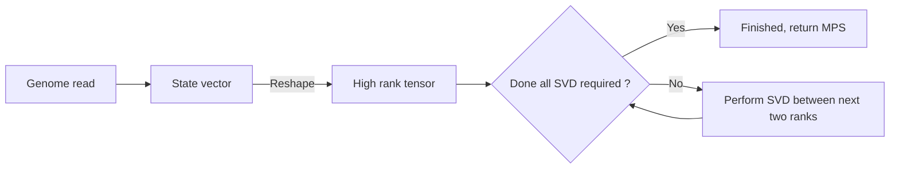
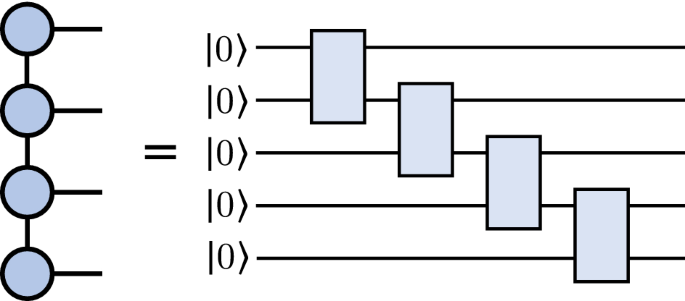
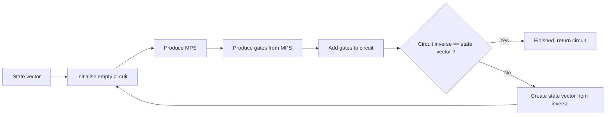
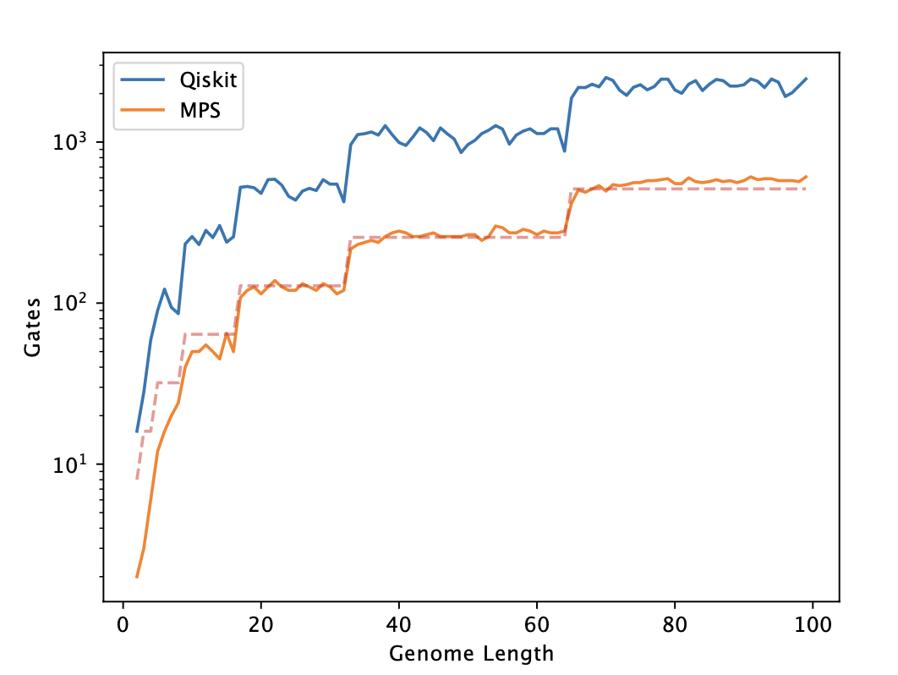

# Overview

This resource describes the functionality of the quantum genome
encoding library that has been developed as part of Phase I of
the Wellcome Leap Quantum Pangenomics project, developed by a
team spanning the University of Melbourne, the University of
Cambridge, Kyiv Academic University, and the Wellcome Trust
Sanger Institute.

The library presents a novel and performant method of encoding
genomic data for use in quantum computing and quantum computing
simulations on high performance computing (HPC) clusters.

## The Algorithm

In broad strokes, the method obtains a quantum circuit encoding
of genomic data by producing a normalised state vector from the
data. This state vector is then transformed into a tensor of
high rank, which is decomposed into a **Matrix Product State** (MPS)
by repeated applications of the Singular Value Decomposition (SVD).
This matrix product state is then used to construct a quantum
circuit by repeatedly applying unitary gates until the desired
fidelity ot the input state is achieved.

### State vector encoding

To encode the genomic data as a normalised quantum state vector,
we use a binary position and base register to obtain a compact
description.

The base register requires two qubits, and we map the bases according
to the following table:

|  A |  T |  G |  C |
|----|----|----|----|
| 00 | 01 | 10 | 11 |

We then combine this with the binary representation of the index along
the genome read to produce a new index for the state vector - the value
of the state vector component at the new index will be set to `1` and
all others will be set to `0`. Finally, the state vector will be
normalised to unit magnitude.

!!! Example
    The (very) short genome read $AT$ can be encoded in 3 qubits, and
    becomes $\frac{1}{\sqrt{2}}(1, 0, 0, 0, 0, 1, 0, 0)$.

In general, this means that a genome of length $L$ requires
$N = \lceil \log_2{L} \rceil + 2$ qubits to be encoded in our framework.

The number of qubits required becomes the number of nodes in the MPS.

The encoding is implemented in `encoding.encode_genome`, there is also a
companion function to decode the state vector into a genome,
`encoding.decode_state`.

### Construction of MPS

We construct the MPS representation of a state vector by first recasting
it as a high rank tensor (i.e. a tensor of rank $2^{N-1}$ where $N$ is the
number of qubits required). No information is lost in this stage as this
is a simple 'reshape' of the vector. Each rank has physical dimension
$d=2$.

The next stage is to decompose the tensor into the MPS form, with a given
bond dimension $D$ (we detail how to calculate this parameter in the next
section). This is done by performing a SVD between each rank (i.e. $2^{N-1}-1$
SVD operations), as illustrated in the figure below
([tensornetwork.org](https://tensornetwork.org/mps/mpstt_diagram.png)):

  

The SVD are performed between each rank in sequence to obtain the MPS encoding.
Importantly, information is lost (in general) in this stage, as we have reduced
the amount of data - this means the fidelity of the representation to the
original state vector is reduced. Strictly, the equality in the figure does not
hold. We can summarise the high-level process in the following flow chart:

This is implemented in `encoding.create_mps`, and can create a MPS from an
arbitrary normalised state vector.

### Fidelity and the required bond dimension

A method is provided in the code to estimate the required bond dimension,
`encoding.analyse_required_bond_dim`. For a given state vector, this method
returns an estimate of the minimum bond dimension required to achieve a
specified fidelity to the input state vector.

In general, a larger bond dimension will give a larger fidelity to the original
state since more of the original data would be retained. However, the
computational cost of working with the MPS increases as the bond dimension
increases for precisely the same reason.

This method will analyse the fidelity of the MPS to the original state vector
for a given bond dimension and incrememnt the bond dimension until the fidelity
required is achieved.

  

Importantly, we do not increment the bond dimension by unity after each check -
we save on computational cost by using a similar method to gradient descent
and estimate the jump in bond dimension required. See the figure above for an
example of the reconstruction error as plotted against the bond dimension
for a read of length 100.

The descent model is tuneable so that the risk of significantly overestimating
the required bond dimension may be mitigated.

### Converting MPS to Quantum Circuits

The correspondence between quantum circuits and MPS is well-understood and
documented, in short a quantum circuit with no gates is the tensor product of
the input qubits. Applying gates is then equivalent to contracting two of the
qubits together. For a two qubit gate, the input qubits are entangled to a tensor
of rank two which can be decomposed with the SVD. Applying this for all the gates
in a generic quantum circuit gives us a MPS state. This is illustrated in the
figure below ([Guala et al., 2023](https://www.nature.com/articles/s41598-023-30258-y)):

  

In the library, we use the method `encoding.convert_mps_to_circuit` to produce a
quantum circuit that is equivalent to a matrix product state. The main input to
the method is the state vector which the quantum circuit should reproduce to a
requested fidelity. The quantum circuits are implemented using the IBM QisKit
API, though we plan to remove QisKit dependence from the library in the future.

The process is iterative, and adds unitary gates to the quantum circuit until the
required acuracy has been achieved. The accuracy is judged at each stage by producing
the inverse of the circuit and comparing to the original state vector.

The key innovation of this method is the method of producing the two-qubit unitary
gates, which uses the MPS formulation of the circuit inverse. The gates are produced
by reorganising the tensor corresponding to each node in the MPS into a matrix, and
concatenating each matrix with its null state. The high-level operation of the
algorithm is shown in the flow chart below:

It is worth focusing on the method of producing gates, this is done by iterating
in reverse through the MPS nodes and applying the procedure specified above. This
means reshaping each node $n_i$ in the tensor network first to $4\times x_i$ matrices
$V_i$ (where $x_i$ is computed dynamically for dimensional consistency). The null
space of the matrix $V_i$ is also computed, which we name $\operatorname{null}(A_i)$.

These matrices are concatenated to form a unitary gate
$U_i=V_i \frown \operatorname{null}(A_i)$, which entangles qubits $N-i-1$ and $N-i$ with
$N$ the total number of qubits.

This method of iteratively adding unitary gates produces circuits more economical in
depth compared to the pure QisKit implementation (using only basic Clifford gates),
as illustrated by the gate count comparisons below:

  

The greater economy in gates is illustrated clearly, the discrete jumps in gate count
indicate an increase in the number of qubits required to encode the genome.

Even without optimisation, the economy of this approach makes clear that MPS can
provide a more favourable encoding than pure QisKit. We relegate the discussion
of the optimisation to future documentation for now.
