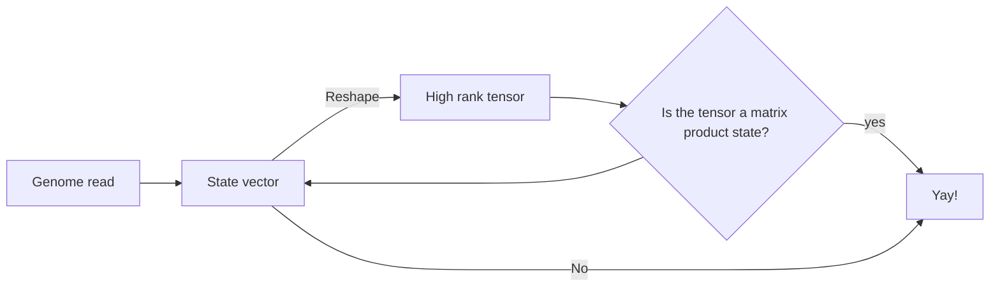

# Overview

This resource describes the functionality of the quantum genome
encoding library that has been developed as part of Phase I of
the Wellcome Leap Quantum Pangenomics project, developed by a
team spanning the University of Melbourne, the University of
Cambridge, Kyiv Academic University, and the Wellcome Trust
Sanger Institute.

The library presents a novel and performant method of encoding
genomic data for use in quantum computing and quantum computing
simulations on high performance computing (HPC) clusters.

## The Algorithm

In broad strokes, the method obtains a quantum circuit encoding
of genomic data by producing a normalised state vector from the
data. This state vector is then transformed into a tensor of
high rank, which is decomposed into a **Matrix Product State** (MPS)
by repeated applications of the Singular Value Decomposition (SVD).
This matrix product state is then used to construct a quantum
circuit by repeatedly applying unitary gates until the desired
fidelity ot the input state is achieved.

### State vector encoding

To encode the genomic data as a normalised quantum state vector,
we use a binary position and base register to obtain a compact
description.

The base register requires two qubits, and we map the bases according
to the following table:

|  A |  T |  C |  G |
|----|----|----|----|
| 00 | 01 | 10 | 11 |

We then combine this with the binary representation of the index along
the genome read to produce a new index for the state vector - the value
of the state vector component at the new index will be set to `1` and
all others will be set to `0`. Finally, the state vector will be
normalised in the regular $L_2$ norm.

!!! Example
    The (very) short genome read $AT$ can be encoded in 3 qubits, and
    becomes $\frac{1}{\sqrt{2}}(1, 0, 0, 0, 0, 1, 0, 0)$.

In general, this means that a genome of length $L$ requires
$N = \lceil \log_2{L} \rceil + 2$ qubits to be encoded in our framework.

The number of qubits required becomes the number of nodes in the MPS.

### Construction of MPS

We construct the MPS representation of a state vector by first recasting
it as a high rank tensor (i.e. a tensor of rank $2^{N-1}$ where $N$ is the
number of qubits required). No information is lost in this stage as this
is a simple 'reshape' of the vector. Each rank has physical dimension
$d=2$.

The next stage is to decompose the tensor into the MPS form, with a given
bond dimension $D$ (we detail how to calculate this parameter in the next
section). This is done by performing a SVD between each rank (i.e. $2^{N-1}-1$
SVD operations), as illustrated in the figure below:

](https://tensornetwork.org/mps/mpstt_diagram.png)

Importantly, information is lost (in general) in this stage, as we have reduced
the amount of data - this means the fidelity of the representation to the
original state vector is reduced.

